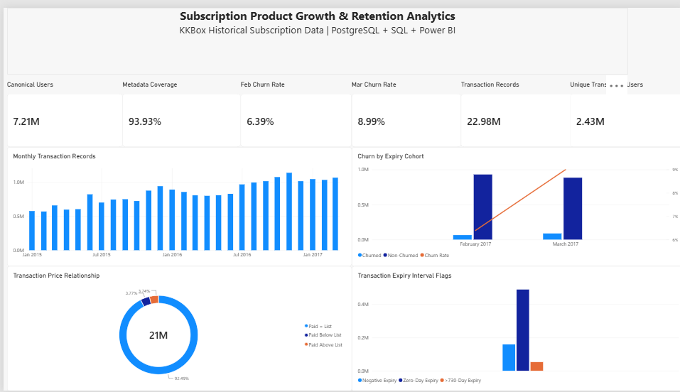

# Subscription Product Growth & Retention Analytics

An end-to-end portfolio project that turns historical KKBox subscription data
into a validated PostgreSQL analytics layer, reproducible SQL findings, and a
one-page Power BI dashboard. The project focuses on customer coverage,
time-dependent churn, transaction activity, and subscription-record patterns
without inventing unsupported financial metrics.

## Business Questions

- How did observed churn and non-churn retention differ between the February
  and March 2017 expiry cohorts?
- How much of the canonical customer universe has optional member metadata?
- How did transaction-record volume and unique transacting users change by month?
- How do auto-renew and cancellation-record patterns differ across cohorts?
- What price, plan-duration, and transaction-to-expiry relationships occur in
  the source records?

## Dataset Scope

The project uses the historical KKBox data supplied for the WSDM churn
competition. The completed V1 covers:

- **7,207,283** canonical users
- **1,963,891** churn observations across two expiry cohorts
- **22,978,755** preserved transaction records
- **2,426,143** distinct transacting users

The 410M+ user-log records have been profiled but are not yet included in the
analytical model. This repository does not claim completed engagement analysis.
Raw competition files are intentionally excluded from Git.

## Architecture

```text
Immutable KKBox CSV files
        ↓
SHA-256 fingerprinting and raw.source_file provenance
        ↓
Typed PostgreSQL staging with source-row lineage
        ↓
Canonical user, churn-observation, and transaction analytics layer
        ↓
Reproducible SQL analysis and compact Power BI aggregates
        ↓
One-page Power BI dashboard
```

## Tech Stack

- PostgreSQL
- SQL
- Python standard library
- Power BI
- Git and GitHub

## Engineering Highlights

- SHA-256 fingerprints identify the exact immutable source versions used.
- Every staged row preserves `source_file_key` and 1-based
  `source_row_number` lineage.
- PostgreSQL `COPY`/`\copy` performs memory-bounded bulk ingestion.
- Large files are streamed rather than loaded fully into Python memory.
- Idempotent loaders skip source versions that are already complete.
- Unusual but structurally valid transaction values are preserved and exposed
  through descriptive quality flags.
- Automated verification checks source counts, lineage, generated fields,
  analytical grains, compact dashboard aggregates, and protected staging state.
- Power BI imports compact 1-28 row presentation datasets instead of the
  22.98M-row transaction-level view for routine visuals.

## Key Findings

- Member metadata covers **93.9255%** of the **7,207,283** canonical users;
  users without member records remain in the customer universe.
- Observed churn increased from **6.3923%** in the February 2017 expiry cohort
  to **8.9942%** in March, a descriptive difference of 2.6019 percentage points.
- Among users present in both cohorts, **5.2161%** changed churn label, confirming
  that churn is a time-dependent observation rather than a permanent attribute.
- The transaction layer contains **22,978,755** preserved records from
  **2,426,143** users.
- **84.7815%** of transaction records have auto-renew enabled, while **3.8818%**
  carry the cancellation flag. Cancellation is not equivalent to churn.
- **87.7954%** of transaction records use 30-day plans, and **92.4856%** have
  actual paid equal to list price.
- In both three-month cohort windows, churned groups had lower observed
  transaction coverage and auto-renew record share, and higher cancellation-
  record share, than non-churned groups. These are associations, not causal
  estimates.

Full definitions, denominators, and supporting results are documented in
[Core Analytics Findings](docs/core_analytics_findings.md).

## Power BI Dashboard



The one-page dashboard presents six headline KPIs, monthly transaction-record
activity, churn and non-churn counts by expiry cohort, price relationships, and
transaction-to-expiry quality flags. Its PostgreSQL sources are compact,
pre-validated summary objects designed for fast Power BI imports.

The report file is available at
[`powerbi/Subscription_Growth_Retention_Analytics.pbix`](powerbi/Subscription_Growth_Retention_Analytics.pbix).

## Repository Structure

```text
data/                 Local raw and derived data (ignored by Git)
docs/                 Design decisions, validation evidence, findings, and images
powerbi/              Finished Power BI report
sql/                  Migrations, automated verification, and analytical queries
src/ingestion/        Fingerprinting, registration, and bounded bulk loaders
src/inspection/       Memory-safe profiling and source-relationship analysis
tests/                Reserved for project tests
```

## Reproducing the Project

1. Obtain the official KKBox competition files and place the seven CSVs under
   `data/raw/`. They are intentionally not committed.
2. Create the PostgreSQL database `subscription_growth_retention` and configure
   credentials outside the repository. Never add passwords or `pgpass.conf` to Git.
3. Run the numbered SQL migrations in order.
4. Fingerprint and register the immutable source files, then run the member,
   churn, and transaction staging loaders.
5. Run the matching SQL verification scripts after each milestone.
6. Execute the core analysis SQL and refresh the compact Power BI materialized
   views before refreshing the PBIX report.

See the documentation and script help output for exact commands and validated
assumptions. The local fingerprint cache under `data/processed/` is also ignored.

## Data Interpretation Caveats

- `is_cancel` is a transaction cancellation flag; it is not the churn label.
- `members_v3.csv` supplies optional enrichment, not the customer universe;
  analytical enrichment uses left-join semantics.
- Calendar-valid but unusual price, plan, and expiry values remain preserved.
- Transaction rows are source records, not proven unique economic payments.
- No net revenue, MRR, ARPU, LTV, or currency interpretation is claimed.

## Limitations and Future Work

- Build bounded streaming aggregation for the 410M+ user-log records.
- Add engagement-versus-churn analysis after validating activity semantics.
- Optionally add a separate operational simulation using Stripe Test Mode and
  FastAPI. This is future work and is not part of the completed KKBox V1.
